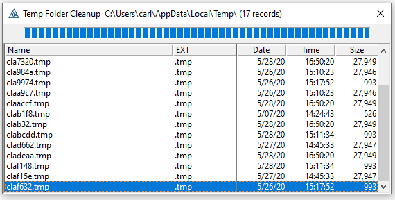
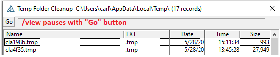

# Temp Clean Clarion

Clarion Reports generate WMF files named CLA###.TMP in the current User Windows Temp folder. A crash, bad code or a process shutdown can leave TMP files behind. A Temp folder full of these can cause problems with preview.

I see CPCS ########.WMF and Tracker PDF*.TMP files being left in the temp folder.

In my frame shutdown I run this Temp Clean every 14 days. It has proved quite useful. At many existing sites I was seeing 1000s of files being purged. it displays the below window with a Progress Bar. 

For this program to really delete file you must change this line from (0) to (1):

```clarion
YES_Delete_Files   EQUATE(0)
```



You can run with a /VIEW switch and the window will pause with a GO button.


